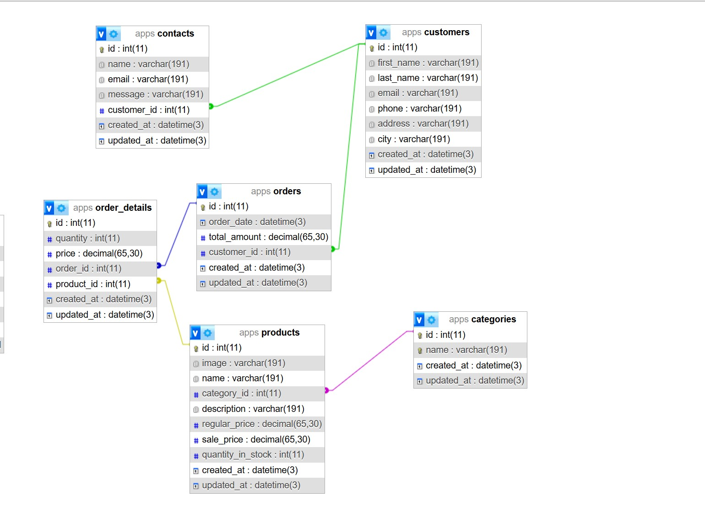

# 2SS_website.github.io
## Project name: Bakery order

## Team member:
+ Dương Thu Hương - 22040003
+ Nguyễn Vân Nhi - 22040006

## Technologies
This project is built with robust and modern technologies to ensure high performance and scalability:

+ EJS templates for rendering HTML pages.
+ Prisma ORM for database access.
+ MySQL database.
+ Environment variables using dotenv.
+ Tailwind CSS for styling.
+ ESLint and Prettier for code linting and formatting.
+ Nodemon for auto-reloading the server during development.
+ Winston for logging.
+ Express-validator for request validation.
+ Compression for compressing the response data.
+ Vite for building the frontend assets. 
+ Build the frontend assets with npm run build.

## Wireframe: 

We will have 3 main pages: Homepage, Menu, Cart-Checkout

More detail: <a href='/content/Wireframe/README.md'>Wireframe</a>

## Planning

We also make detail plan to make sure equal contribution and easy to tracking

More detail: <a href='/content/Planning/README.md'>Planning</a>

## Database

## Database Schema Overview

1. **Contacts**
   - id, name, email, message, customer_id, timestamps

2. **Customers**
   - id, first_name, last_name, email, phone, address, city, timestamps

3. **Orders**
   - id, order_date, total_amount, customer_id, timestamps

4. **Order Details**
   - id, quantity, price, order_id, product_id, timestamps

5. **Products**
   - id, image, name, category_id, description, prices, quantity_in_stock, timestamps

6. **Categories**
   - id, name, timestamps

### Relationships
- Contacts ↔ Customers: customer_id
- Orders ↔ Customers: customer_id
- Order Details ↔ Orders: order_id
- Order Details ↔ Products: product_id
- Products ↔ Categories: category_id

## Video demo

<a href="/webapp/public/2wb_webfinal.mp4"> Video demo </a>