# 2SS_website.github.io
## Project name: Bakery order

## Team member:
+ Dương Thu Hương - 22040003
+ Nguyễn Vân Nhi - 22040006

## Wireframe: 

We will have 6 main pages:

- **Homepage:** Include all basic information about the bakery
    + Hover view information of product in Best Seller part
    + Pop up items in cart and automatic calculate
    + Hover search page when click search icon
    + Embeded map
      
  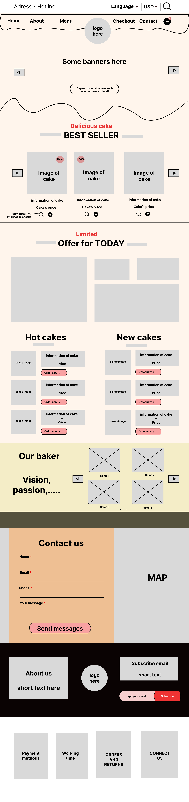
  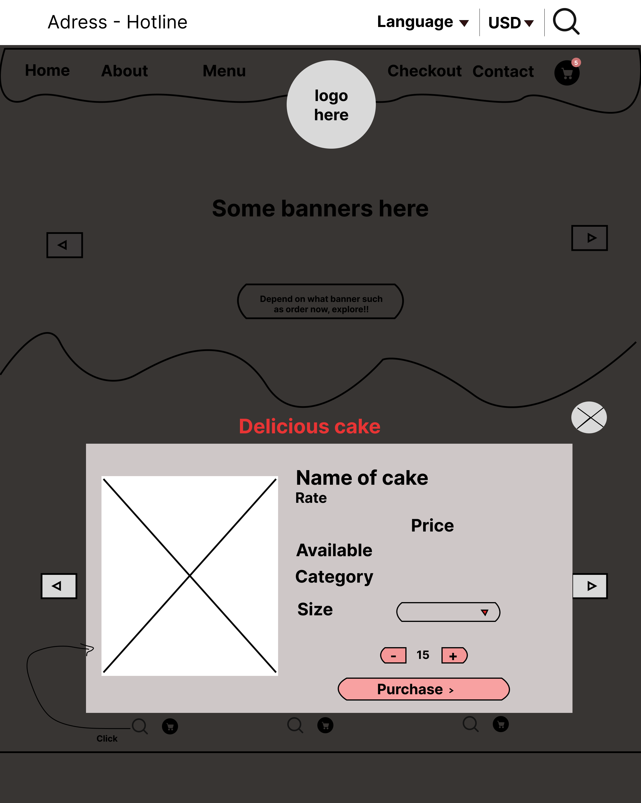
  
  

- **About us**
  
  
  
- **Menu:**
    + Grid view of product list
    + Have fitler for better searching
    + Have hover view information of each product
    + Have shopping cart for faster buy
    + Have sort by price and name
      
  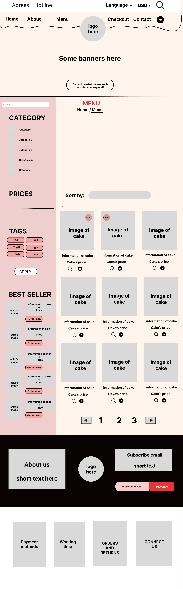
  
  
- **Cart:**
  
    + Automatic calculate total final price of each products when add or remove quantity
    + Automatic calculate total cost of all products
    + Automatic calculate final cost after apply promotion code

      
  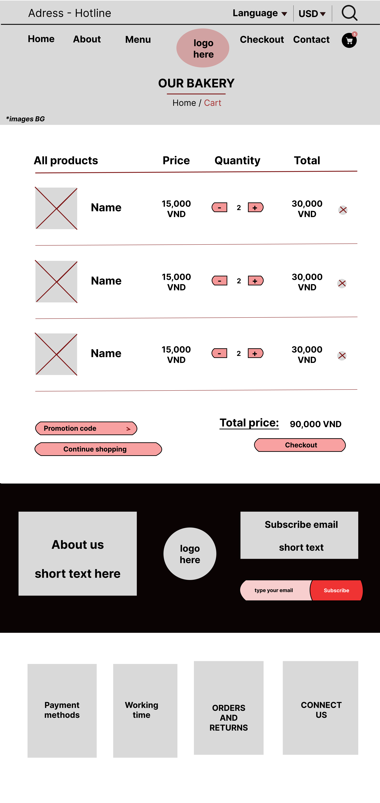
  
- **Checkout:**
    + Have bill part for better vision to order
    + Collect information of customer to delivery
    + Thank you page after customer buy successfully
      
  

  
- **Contact us**
    + Embaded map
    + Form to send customer's ideas
      
  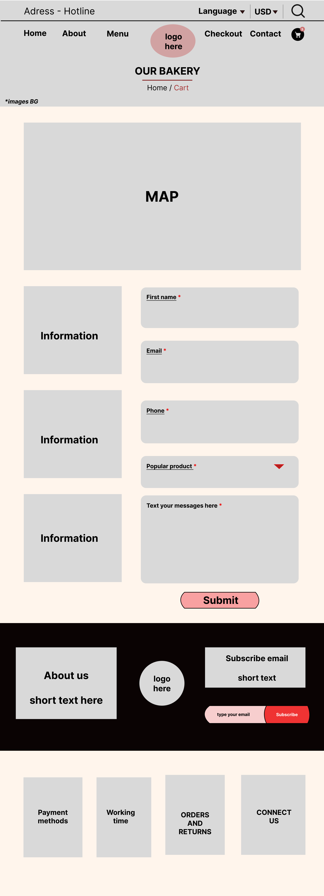

## Planning

    <table class="min-w-full border-collapse border border-gray-400">
        <thead>
            <tr>
                <th class="border border-gray-400 bg-purple-200 px-4 py-2"><b>Name page</b></th>
                <th class="border border-gray-400 bg-purple-200 px-4 py-2"><b>Week</b></th>
                <th class="border border-gray-400 bg-purple-200 px-4 py-2"><b>Task</b></th>
                <th class="border border-gray-400 bg-purple-200 px-4 py-2"><b>Detail</b></th>
                <th class="border border-gray-400 bg-purple-200 px-4 py-2"><b>Image</b></th>
                <th class="border border-gray-400 bg-purple-200 px-4 py-2"><b>Process</b></th>
                <th class="border border-gray-400 bg-purple-200 px-4 py-2"><b>Assign to<b></th>
            </tr>
        </thead>
        <tbody>
            <tr>
                <td class="border border-gray-400 px-4 py-2"></td>
                <td class="border border-gray-400 px-4 py-2" rowspan="13">Week 1</td>
                <td class="border border-gray-400 px-4 py-2">Create Wireframe</td>
                <td class="border border-gray-400 px-4 py-2"></td>
                <td class="border border-gray-400 px-4 py-2"></td>
                <td class="border border-gray-400 px-4 py-2">Done</td>
                <td class="border border-gray-400 px-4 py-2">Thu Huong & Van Nhi</td>
            </tr>
            <tr>
                <td class="border border-gray-400 px-4 py-2" rowspan="2">Set up</td>
                <td class="border border-gray-400 px-4 py-2">Setup NPM and Vite</td>
                <td class="border border-gray-400 px-4 py-2"></td>
                <td class="border border-gray-400 px-4 py-2"></td>
                <td class="border border-gray-400 px-4 py-2">Done</td>
                <td class="border border-gray-400 px-4 py-2">Thu Huong</td>
            </tr>
            <tr>
                <td class="border border-gray-400 px-4 py-2">Setup Tailwind CSS</td>
                <td class="border border-gray-400 px-4 py-2"></td>
                <td class="border border-gray-400 px-4 py-2"></td>
                <td class="border border-gray-400 px-4 py-2">Done</td>
                <td class="border border-gray-400 px-4 py-2">Thu Huong</td>
            </tr>
            <tr>
                <td class="border border-gray-400 px-4 py-2" rowspan="10">Homepage</td>
                <td class="border border-gray-400 px-4 py-2">Heading top and pop hover search icon</td>
                <td class="border border-gray-400 px-4 py-2">
                </td>
                <td class="border border-gray-400 px-4 py-2">
                    
                    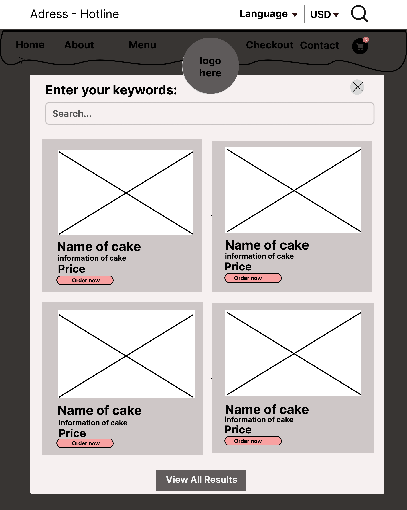
                </td>
                <td class="border border-gray-400 px-4 py-2">Done</td>
                <td class="border border-gray-400 px-4 py-2">Thu Huong</td>
            </tr>
            <tr>
                <td class="border border-gray-400 px-4 py-2">Footer</td>
                <td class="border border-gray-400 px-4 py-2 whitespace-normal">
                 Design UI footer 
                 Add links for About us, Subscribe to email, Payment methods, Working time, Orders and returns, Connect us. 
                 Include a logo in the footer. 
                 Implement an email subscription form with a button. 
                 </td>
                 <td class="border border-gray-400 px-4 py-2">
                    
                </td>
                <td class="border border-gray-400 px-4 py-2">Done</td>
                <td class="border border-gray-400 px-4 py-2">Van Nhi</td>
            </tr>
             <tr>
                <td class="border border-gray-400 px-4 py-2">Content</td>
                <td class="border border-gray-400 px-4 py-2 whitespace-normal">
                Design all the images and content in Homepage
                </td>
            <td class="border border-gray-400 px-4 py-2"></td>
                <td class="border border-gray-400 px-4 py-2">Done</td>
                <td class="border border-gray-400 px-4 py-2">Van Nhi</td>
            </tr>
            <tr>
                <td class="border border-gray-400 px-4 py-2">Banner slideshow</td>
                <td class="border border-gray-400 px-4 py-2"></td>
                <td class="border border-gray-400 px-4 py-2">
                    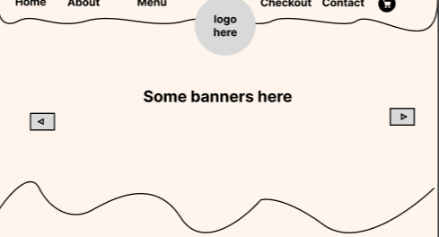
                </td>
                <td class="border border-gray-400 px-4 py-2">Done</td>
                <td class="border border-gray-400 px-4 py-2">Thu Huong</td>
            </tr>
            <tr>
                <td class="border border-gray-400 px-4 py-2">Limited, Hot cake, new cake part</td>
                <td class="border border-gray-400 px-4 py-2"></td>
                <td class="border border-gray-400 px-4 py-2">
                    
                </td>
                <td class="border border-gray-400 px-4 py-2">Done</td>
                <td class="border border-gray-400 px-4 py-2">Van Nhi</td>
            </tr>
            <tr>
                <td class="border border-gray-400 px-4 py-2">Our baker part</td>
                <td class="border border-gray-400 px-4 py-2"></td>
                <td class="border border-gray-400 px-4 py-2">
                    
                </td>
                <td class="border border-gray-400 px-4 py-2">Done</td>
                <td class="border border-gray-400 px-4 py-2">Van Nhi</td>
            </tr>
            <tr>
                <td class="border border-gray-400 px-4 py-2">Map and contact us</td>
                <td class="border border-gray-400 px-4 py-2"></td>
                <td class="border border-gray-400 px-4 py-2">
                    
                </td>
                <td class="border border-gray-400 px-4 py-2">Done</td>
                <td class="border border-gray-400 px-4 py-2">Thu Huong</td>
            </tr>
            <tr>
                <td class="border border-gray-400 px-4 py-2">Cart popup</td>
                <td class="border border-gray-400 px-4 py-2"></td>
                <td class="border border-gray-400 px-4 py-2">
                    
                </td>
                <td class="border border-gray-400 px-4 py-2">Done</td>
                <td class="border border-gray-400 px-4 py-2">Thu Huong</td>
            </tr>
            <tr>
                <td class="border border-gray-400 px-4 py-2">Cake Information hover</td>
                <td class="border border-gray-400 px-4 py-2"></td>
                <td class="border border-gray-400 px-4 py-2">
                    
                </td>
                <td class="border border-gray-400 px-4 py-2">Done</td>
                <td class="border border-gray-400 px-4 py-2">Thu Huong</td>
            </tr>
            <tr>
                <td class="border border-gray-400 px-4 py-2">Best Seller slide show</td>
                <td class="border border-gray-400 px-4 py-2"></td>
                <td class="border border-gray-400 px-4 py-2">
                    
                </td>
                <td class="border border-gray-400 px-4 py-2">Done</td>
                <td class="border border-gray-400 px-4 py-2">Thu Huong</td>
            </tr>
            <tr>
                <td class="border border-gray-400 px-4 py-2">About us</td>
                <td class="border border-gray-400 px-4 py-2" rowspan="13">Week 2</td>
                <td class="border border-gray-400 px-4 py-2">Create complete page</td>
                <td class="border border-gray-400 px-4 py-2">
                Design all UI and javascript in About us page
                </td>
                <td class="border border-gray-400 px-4 py-2">
                    
                </td>
                <td class="border border-gray-400 px-4 py-2">Done</td>
                <td class="border border-gray-400 px-4 py-2">Van Nhi</td>
            </tr>
            <tr>
                <td class="border border-gray-400 px-4 py-2">Cart</td>
                <td class="border border-gray-400 px-4 py-2">Create complete page</td>
                <td class="border border-gray-400 px-4 py-2">
                Design all UI and javascript in Cart page
                </td>
                <td class="border border-gray-400 px-4 py-2">
                    
                </td>
                <td class="border border-gray-400 px-4 py-2">Done</td>
                <td class="border border-gray-400 px-4 py-2">Thu Huong</td>
            </tr>
            <tr>
                <td class="border border-gray-400 px-4 py-2" rowspan="5">Menu</td>
                <td class="border border-gray-400 px-4 py-2">Header and Footer</td>
                <td class="border border-gray-400 px-4 py-2">
                 Header top 
                 Banner slideshow 
                 Footer 
                 ==> Take in homepage 
                </td>
                 <td class="border border-gray-400 px-4 py-2">
                    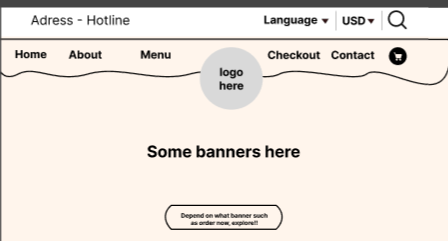
                    
                </td>
                <td class="border border-gray-400 px-4 py-2">Done</td>
                <td class="border border-gray-400 px-4 py-2"></td>
            </tr>
                <td class="border border-gray-400 px-4 py-2">Thank you page</td>
                <td class="border border-gray-400 px-4 py-2">Create complete page</td>
                 <td class="border border-gray-400 px-4 py-2">
                    
                </td>
                <td class="border border-gray-400 px-4 py-2">Done</td>
                <td class="border border-gray-400 px-4 py-2">Van Nhi</td>
            </tr>
             <tr>
                <td class="border border-gray-400 px-4 py-2">Database</td>
                <td class="border border-gray-400 px-4 py-2">Create database</td>
                <td class="border border-gray-400 px-4 py-2"></td>
                 <td class="border border-gray-400 px-4 py-2"></td>
                <td class="border border-gray-400 px-4 py-2">In progress</td>
                <td class="border border-gray-400 px-4 py-2">Thu Huong and Van Nhi</td>
            </tr>
            <tr>
                <td class="border border-gray-400 px-4 py-2" rowspan="2">Checkout</td>
                <td class="border border-gray-400 px-4 py-2">Form collect iniormation</td>
                <td class="border border-gray-400 px-4 py-2">
                 Form for customer to collect shipping information 
                </td>
                 <td class="border border-gray-400 px-4 py-2">
                    
                 </td>
                <td class="border border-gray-400 px-4 py-2">Done</td>
                <td class="border border-gray-400 px-4 py-2">Thu Huong</td>
            </tr>
            <tr>
                <td class="border border-gray-400 px-4 py-2">Billing</td>
                <td class="border border-gray-400 px-4 py-2">
                 Show customer's bill after add voucher, shipping,etc 
                </td>
                 <td class="border border-gray-400 px-4 py-2">
                    
                 </td>
                <td class="border border-gray-400 px-4 py-2">Done</td>
                <td class="border border-gray-400 px-4 py-2">Thu Huong</td>
            </tr>
            <tr>
                <td class="border border-gray-400 px-4 py-2" rowspan="3">Contact us</td>
                <td class="border border-gray-400 px-4 py-2">Map</td>
                <td class="border border-gray-400 px-4 py-2">
                 Embeded map 
                </td>
                 <td class="border border-gray-400 px-4 py-2">
                    
                 </td>
                <td class="border border-gray-400 px-4 py-2">Done</td>
                <td class="border border-gray-400 px-4 py-2">Van Nhi</td>
            </tr>
            <tr>
                <td class="border border-gray-400 px-4 py-2">Form</td>
                <td class="border border-gray-400 px-4 py-2">
                 Form to collect customer's message 
                </td>
                 <td class="border border-gray-400 px-4 py-2">
                    
                 </td>
                <td class="border border-gray-400 px-4 py-2">Done</td>
                <td class="border border-gray-400 px-4 py-2">Thu Huong</td>
            </tr>
            <tr>
                <td class="border border-gray-400 px-4 py-2">Product grid</td>
                <td class="border border-gray-400 px-4 py-2">
                 Show product in grid list 
                </td>
                 <td class="border border-gray-400 px-4 py-2">
                    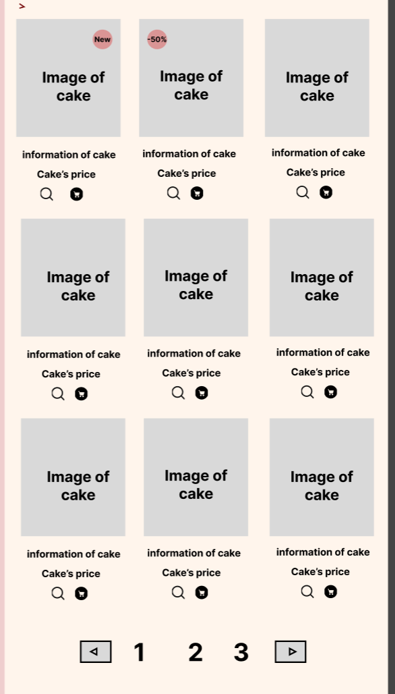
                </td>
                <td class="border border-gray-400 px-4 py-2">To do</td>
                <td class="border border-gray-400 px-4 py-2">Van Nhi</td>
            </tr>
            <tr>
                <td class="border border-gray-400 px-4 py-2">Filter for better search</td>
                <td class="border border-gray-400 px-4 py-2">
                 Search by keyword 
                 Filter category 
                 Sort by price and alphabet 
                </td>
                 <td class="border border-gray-400 px-4 py-2">
                    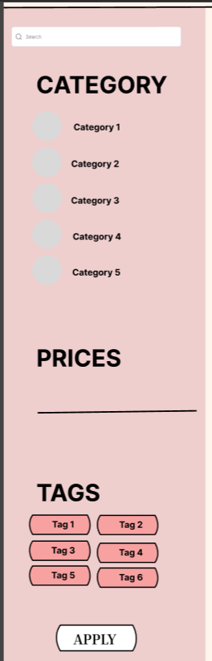
                    
                </td>
                <td class="border border-gray-400 px-4 py-2">To do</td>
                <td class="border border-gray-400 px-4 py-2">Van Nhi</td>
            </tr>
            <tr>
                <td class="border border-gray-400 px-4 py-2">Best Seller in Menu</td>
                <td class="border border-gray-400 px-4 py-2"></td>
                 <td class="border border-gray-400 px-4 py-2">
                    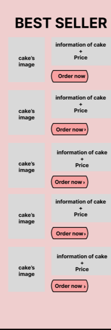
                </td>
                <td class="border border-gray-400 px-4 py-2">To do</td>
                <td class="border border-gray-400 px-4 py-2">Van Nhi</td>
            </tr>
            <tr>
                <td class="border border-gray-400 px-4 py-2">product Information hover</td>
                <td class="border border-gray-400 px-4 py-2"></td>
                 <td class="border border-gray-400 px-4 py-2">
                    
                </td>
                <td class="border border-gray-400 px-4 py-2">To do</td>
                <td class="border border-gray-400 px-4 py-2">Van Nhi</td>
            </tr>
            <tr>
                <td class="border border-gray-400 px-4 py-2"></td>
                <td class="border border-gray-400 px-4 py-2" rowspan="2">Week 3</td>
                <td class="border border-gray-400 px-4 py-2">Fix UI</td>
                <td class="border border-gray-400 px-4 py-2">Fix all UI follow feedback</td>
                <td class="border border-gray-400 px-4 py-2"></td>
                <td class="border border-gray-400 px-4 py-2">To do</td>
                <td class="border border-gray-400 px-4 py-2">Thu Huong & Van Nhi</td>
            </tr>
            <tr>
                <td class="border border-gray-400 px-4 py-2">Implement backend, server-side</td>
                <td class="border border-gray-400 px-4 py-2"></td>
                <td class="border border-gray-400 px-4 py-2"></td>
                <td class="border border-gray-400 px-4 py-2"></td>
                <td class="border border-gray-400 px-4 py-2">To do</td>
                <td class="border border-gray-400 px-4 py-2">Thu Huong & Van Nhi</td>
            </tr>
             <tr>
                <td class="border border-gray-400 px-4 py-2"></td>
                <td class="border border-gray-400 px-4 py-2" >Week 4</td>
                <td class="border border-gray-400 px-4 py-2">Finish the project</td>
                <td class="border border-gray-400 px-4 py-2">Fix UI (if necessary) and server-side</td>
                <td class="border border-gray-400 px-4 py-2"></td>
                <td class="border border-gray-400 px-4 py-2">To do</td>
                <td class="border border-gray-400 px-4 py-2">Thu Huong & Van Nhi</td>
            </tr>
        </tbody>
    </table>

